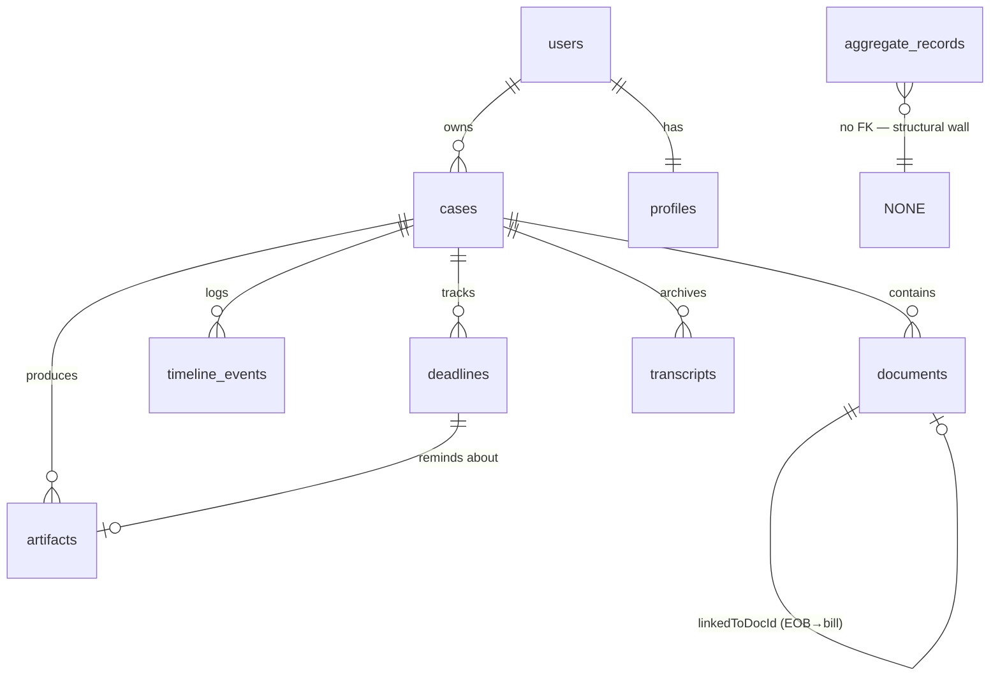
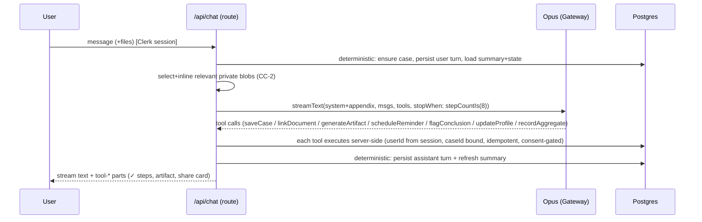
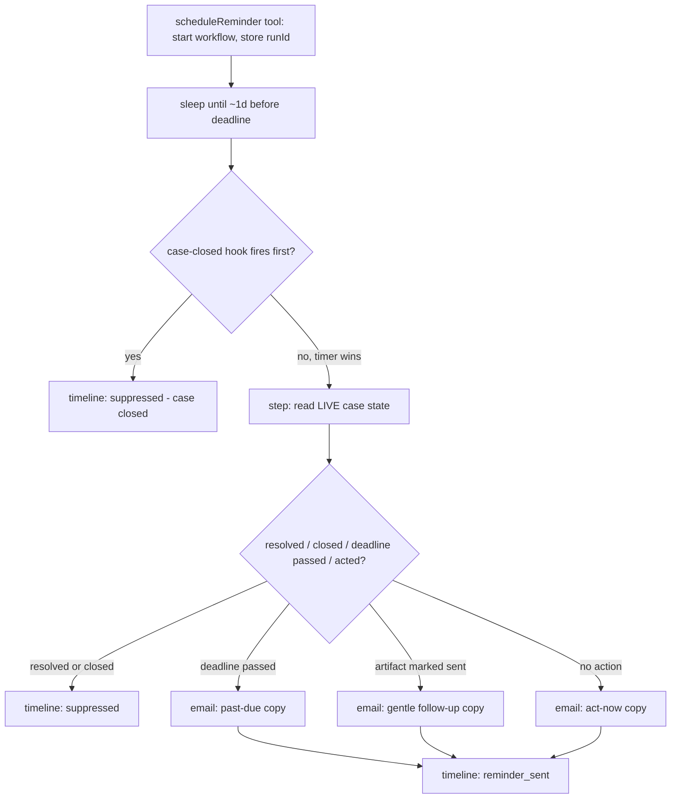

# billcheck v1 — the persistent advocate

## Summary

Turn the validated, stateless prototype into a **persistent advocate**: it remembers the case across visits, drafts the real artifact, tracks deadlines with a durable smart reminder, and ends with a shareable card. The model's reasoning is frozen (it's already strong and safe — see [docs/observations/SUMMARY.md](../observations/SUMMARY.md)); v1 builds the **deterministic "hands and memory"** around it — auth, a Postgres case spine, model-callable tools, and one Vercel Workflow. The approach is additive: the existing `streamText` chat route stays the brain and grows a `tools` map; everything else slots underneath it.

---

## Problem Frame

The prototype answers well but forgets everything, can't act, and can't track a clock — so a user has no reason to choose it over ChatGPT. The wedge is the things a foundation model structurally can't do: remember the case, act in the real world, and be trustworthy enough to hand a bill to (see origin: [docs/brainstorms/2026-06-25-billcheck-v1-requirements.md](../brainstorms/2026-06-25-billcheck-v1-requirements.md)).

---

## Requirements

Traced from the origin requirements doc (R1–R16). v1 scope = R1, R3 (account tier), R4–R12, R14, R15 (generic), R16.

- **R1.** Signup-first (anonymous-first + gating is v1.1).
- **R3.** Consent tiers — account-tier collected at signup; aggregate-tier as a separate opt-in (default OFF).
- **R4.** A **Case** is a first-class object: bill(s), EOB(s)/docs, profile, timeline, deadlines.
- **R5.** Document linking — know which EOB/doc belongs to which bill; survive out-of-order uploads.
- **R6.** One **active session** per case; prior sessions stored as transcript objects; the active session is seeded with a **case summary + structured state**, not raw transcripts.
- **R7.** Cross-case awareness without losing track of each object/action.
- **R8.** Stored profile/situation (insurer, plan type, veteran/Medicaid/QMB/income…) applied across sessions — ask once, reuse, proactively apply.
- **R9.** Artifact generation, personalized from the stored profile (fill the blanks).
- **R10.** Deliver: v1 renders download/print/copy; real send is **mocked** but marked "sent" on the timeline.
- **R11.** Artifacts + their deadlines saved to the case as tracked objects.
- **R12.** **Smart reminder** — a durable Vercel Workflow that checks case state at the deadline and tailors/suppresses the nudge; channel = email; v1 "new info" = user-side changes.
- **R14.** Anonymized structured data capture from user #1, stored separate from the personal case, behind the aggregate consent tier.
- **R15.** Generic **share card** when a case "concludes" (model-flagged) + a persistent manual share/recap button.
- **R16.** Treat the system prompt as **frozen**; build capability via tools + memory + structured state.

**Success criteria (v1):** a person uses billcheck instead of ChatGPT because it (1) remembers the case across visits, (2) produces the actual artifact, (3) proactively nudges the deadline, and (4) yields a share card on conclusion — demoable end-to-end on Vercel.

**Origin actors:** the scared individual (~30–55), signup-first D2C. **Origin flows:** signup → case → upload → analyze/probe → artifact → deadline+reminder → conclusion → share. Wellthy is a channel/pilot, not a v1 build target.

---

## Scope Boundaries

**In v1:** R1, R3 (account tier), R4–R12, R14, R15 (generic card), R16.

### Deferred for later (v1.1+)
- Anonymous-first onboarding + the anonymous→account migration + feature-gating (R1/R3 full).
- Real artifact send (fax/mail/email, likely paid) (R10).
- Cited-KB / retrieval with trusted source links (R13).
- Rich external reminder signals (EOB posted, provider replied) (R12).
- Nicer/selective "legible-win" share card design (R15).

### Outside this product's identity (north-star, not now)
- Insurance-portal connect (Granted = swamp) and MyChart/clinical integration.
- Public price-index product; journalist/outrage pipeline; benefits navigator; GFE/upstream prevention.
- Wellthy/employer software integration; pricing / pay-what-you-want.

### Deferred to Follow-Up Work
- A full compliance program (BAA-grade infra, formal de-id certification). v1 bakes the *cheap* primitives (separate consent, two-store separation, no health data in logs, deletion path) and flags the rest — consistent with AGENTS.md "no PHI/compliance machinery yet (own/synthetic bills only)."

---

## Context & Research

### Relevant code and patterns (extend, don't rebuild)
- `app/api/chat/route.ts` — the brain: `streamText` + AI Gateway string `"anthropic/claude-opus-4.8"` + `await convertToModelMessages(await inlinePrivateBlobs(messages))`. v1 attaches `tools` + `stopWhen: stepCountIs(n)` here and inserts userId/caseId scoping + deterministic persistence + a per-turn document-selection rule.
- `inlinePrivateBlobs()` — fetches private-blob bytes server-side and inlines them as base64 data URLs (the model can't fetch URLs). **Reuse**, but (a) it currently re-inlines *every* file part *every* turn — does not survive persistence (CC-2), and (b) it fails *silently* on a non-OK fetch — must surface.
- `app/api/blob-upload/route.ts` — client-upload token route (`handleUpload`, allow-list, 10 MB). Currently **unauthenticated** and rejects HEIC silently — both fixed in v1.
- `lib/prompt.ts` — the frozen `SYSTEM_PROMPT` (R16). Add a small tool-usage appendix only (visible before/after); the advice prose is untouched.
- `app/page.tsx` — single-screen `useChat` client; renders `message.parts` by type. v1 adds routes/screens and renders `tool-*` parts.

### Institutional learnings
- **Freeze the prompt, build hands not answers** — 33 sims, 0 safety failures; the gap is execution, not reasoning.
- **Model choice is a safety control** — Opus needs AI-Gateway credits in *every* environment; free tier silently down-tiers to Haiku, which is unsafe here. v1's reminder makes **no model call** (rule-based tailoring), so the Workflow runtime needs no gateway access.
- **Private-blob fetch→inline + `convertToModelMessages` is async** — keep both; documents now *persist* (add metadata + access control; there is no `del()` to remove — the prototype already retains).
- **Two render bugs (white-space, remark-gfm) were invisible to text-only testing** — budget a browser/integration pass for every new rendered surface.
- **One hallucination class (a fabricated FDA date)** → artifact generation fills from profile and leaves external facts as *attributed placeholders*; no cited-KB gate (R9/R13).
- No `docs/solutions/` exists — capture this build with `/ce-compound` after it lands.

### External references (version-checked against installed packages)
- **AI SDK v6 (`ai@6.0.209`):** `tool({ inputSchema })` (not `parameters`), `stopWhen: stepCountIs(n)` (not `maxSteps`/`isStepCount`), `hasToolCall`, `onStepFinish`, `Output.object`. Default `stopWhen` is one step — must set it or tools won't loop. Tools surface as `tool-<name>` parts (`state`: input-streaming → input-available → output-available).
- **Vercel Workflows / WDK (`workflow`):** `'use workflow'` / `'use step'`; durable `sleep(date|duration)` (zero compute while waiting, survives redeploys); `start()` from `workflow/api`; `createHook`/`resumeHook` for early wake; **no native idempotency key on `start()`** (dedup yourself); determinism rule (no IO/`Date.now`/random in the workflow body — only in steps); skew protection pins a run to its deployment (keep the body thin). **Pin `workflow@^4.5.0`** (the verified surface; the registry also carries a 5.x beta that could resolve on a bare install).
- **Next.js 16:** root middleware file renamed `middleware.ts` → **`proxy.ts`** (Clerk/Auth.js key off this).
- **Storage:** first-party Vercel Postgres/KV are sunset → **Neon Postgres** + **Upstash Redis** via Marketplace; `@vercel/blob` unaffected. **Drizzle** + `neon-http` driver (lazy `getDb()`, no top-level client, no Proxy wrapper; `drizzle-kit push` via `dotenv -e .env.local`).
- **Auth:** **Clerk** (Marketplace-native, drop-in signup-first UI). **Resend** for email (called inside a Workflow step with `stepId` as idempotency key).
- **Compliance:** not a HIPAA covered entity, but **WA MHMDA applies with no size threshold** (separate opt-in consent, privacy policy, deletion, breach plan) and FTC HBNR applies. Bake the cheap primitives now.

---

## Key Technical Decisions

- **Neon Postgres + Drizzle, docs in Blob, metadata in Postgres.** Two drivers by path: **`neon-serverless` (WebSocket) for the write path** (it supports `db.transaction()`; `neon-http` does **not**) and `neon-http` for simple scoped reads. Lazy `getDb()` avoids build-time/init footguns. *(Alt: Prisma — heavier on serverless.)*
- **Clerk for auth, signup-first.** Drop-in UI + Marketplace auto-provisioning = fastest-correct. *(Alt: Auth.js v5 — more wiring, no hosted screens.)*
- **The smart reminder is a Vercel Workflow, not Cron+queue.** A reminder is one durable timer keyed to a deadline that must read live state on wake and be cancellable — exactly `sleep()` + a `case-closed` hook race. Cron would re-implement timers, dedup, and state polling by hand.
- **Capability via model-callable tools wired into the existing `streamText`** (R16). One orchestrator, no second framework, no `ToolLoopAgent` wrapper for live chat.
- **Deterministic vs. model-driven split (the central safety seam, CC-1):** case existence + transcript persistence happen **deterministically every turn**, never hostage to a model tool call. Semantic actions (link doc, generate artifact, schedule reminder, update profile, flag conclusion, record aggregate) are tools — each **server-authoritative** (userId from the Clerk session, caseId bound server-side, never from model args), **idempotent**, and **input-validated** (Zod + `experimental_repairToolCall`).
- **Two privacy-critical guards are server-enforced, not prompt-enforced:** (1) `recordAggregate` checks the aggregate consent tier server-side and drops the write if false; (2) the **share card is generated from a structured-state field whitelist**, never from the raw transcript or document text.
- **Per-turn document inlining is selective** (CC-2): only documents relevant to the turn (newly added / referenced / explicitly requested) are inlined, not the whole case. Blob-fetch failure surfaces to the user instead of silently degrading.
- **Model-omission backstops:** artifact creation and share/recap each get a deterministic UI affordance (a button) so they don't depend on the model remembering to call the tool — mirroring R15's manual button, extended to artifacts.
- **Testing posture:** manual/browser verification + the existing probe for model behavior (consistent with the prototype), **plus a light unit-test layer (`node:test` or vitest) for the pure-logic safety/privacy guards only** — consent gate, aggregate de-identification/PII-strip, reminder branch selection, idempotency keys. These are cheap pure functions where a silent bug is catastrophic and invisible to manual testing.
- **Blob inlining is the document-authorization boundary**, not just a performance rule: inline candidates resolve from the DB by `(caseId, userId)`, never from the client-sent `part.url`; ownership is asserted before each fetch (closes a cross-tenant IDOR/SSRF — see Hardening).
- **Derived case summary** (rebuilt from the transcript when stale) instead of a second write per turn — removes the turn-persist atomicity requirement by construction. Persist the **blob URL, never the inlined base64**. *Prefer a deterministic structured-state→prose template; if regeneration uses the model, it's a second per-turn call — budget the cost/latency, pin it to funded Opus (a silent down-tier to Haiku would poison the persistent seed), and fall back to the prior summary on failure, never an empty seed.*
- **The anonymized aggregate row is written once, at conclusion, with the outcome inline** (UUID PK, jittered insertion time, consent checked before compute) — one choice that fixes append-non-idempotency, timing/sequence re-join, and outcome-backfill together. Not a Phase-1 / free model-tool write.
- **Confirm-to-commit** on artifact finalize + reminder arm (the backstop buttons are the commit point) — contains document-borne prompt injection now that the model can call action tools.
- **`drizzle-kit push` for the synthetic-only demo; cut over to versioned migrations at the first real signup** (push silently drops/rewrites columns to reconcile a diff — irreversible on real data).

---

## High-Level Technical Design

> *Directional guidance for review, not implementation specification.*

**Data model (Postgres; the `aggregate_records` table deliberately has no key back to a person):**

**The chat turn (one orchestrator, tools + deterministic persistence):**

**The smart reminder Workflow (durable, state-aware, cancellable):**

---

## Output Structure

New/changed top-level shape (additive to the existing `app/`):

    proxy.ts                      # Clerk middleware (Next 16 rename)
    drizzle.config.ts
    lib/
      db/
        index.ts                  # lazy getDb() neon-http (reads) + getWriteDb() neon-serverless (transactional writes)
        schema.ts                 # all tables
        cases.ts, documents.ts, profile.ts, deadlines.ts, artifacts.ts, aggregate.ts  # scoped queries
      auth.ts                     # requireUserId() helper
      tools/
        index.ts                  # makeTools(userId) -> tools map
        *.ts                      # one file per tool
      artifacts/generate.ts       # artifact templating from profile
      share/card.ts               # whitelist -> card (no PII)
      aggregate/deidentify.ts     # Safe-Harbor-grade field hygiene (pure, unit-tested)
      reminder/state.ts           # pure branch-selection (unit-tested)
      email/resend.ts
    lib/workflows/
      reminder.ts                 # 'use workflow' + 'use step'
    app/
      (app)/cases/page.tsx        # case list + empty state
      (app)/cases/[id]/page.tsx   # case detail (timeline, artifacts, share)
      api/chat/route.ts           # MODIFIED: auth, case spine, tools, selective inline
      api/blob-upload/route.ts    # MODIFIED: auth + HEIC + clearer errors
    test/                         # light unit tests for the pure guards only

---

## Implementation Units

> Phased: **Phase 1 (Saturday hackathon slice)** = U1–U6 (thin cuts) + U7; **Phase 2 (v1 proper)** = U8–U12 + the deferred-within-unit completeness. See Phased Delivery.

### U1. Auth + persistence foundation

**Goal:** Clerk auth (signup-first) + Neon Postgres + Drizzle wired, with the full schema and per-user scoping baseline.

**Requirements:** R1, R4 (substrate), R16 (substrate)

**Dependencies:** None

**Files:**
- Create: `proxy.ts`, `lib/auth.ts` (`requireUserId()`), `lib/db/index.ts` (lazy `getDb()`), `lib/db/schema.ts`, `drizzle.config.ts`
- Modify: `app/layout.tsx` (`ClerkProvider`), `package.json`, `.env.local`/Vercel env
- Test: `test/db-scoping.test.ts`

**Approach:**
- `vercel integration add clerk` + `neon`; auto-provisioned env. `clerkMiddleware()` in `proxy.ts` (NOT `middleware.ts` — Next 16). `requireUserId()` reads the session server-side; **every** scoped query filters `where(eq(table.userId, userId))`.
- Drizzle schema for all tables (see ERD): `users, profiles, cases, documents, timeline_events, deadlines, artifacts, transcripts, aggregate_records` (`aggregate_records` uses a **random UUID PK**, no serial — see Hardening).
- **Two lazy drivers by path** (never a top-level client or Proxy wrapper): `getDb()` = `neon-http` for scoped reads; `getWriteDb()` = `neon-serverless` (WebSocket) for the transactional write path (`neon-http` can't run `db.transaction()`). Every scoped access goes through per-table modules taking `userId` as a required first arg (the cheap forgotten-`where` guard).
- `drizzle-kit push` via `dotenv -e .env.local` for the synthetic demo; **cut over to versioned migrations at the first real signup** (push silently drops/rewrites columns on real data).
- RLS is deferred to U12 (defense-in-depth); the per-table scoped modules + the cross-user-invisibility test (a Phase-1 gate) are the v1 baseline.

**Patterns to follow:** single-export `lib/` modules, `@/` imports; env handling like the existing `AI_GATEWAY_API_KEY`/`BLOB_READ_WRITE_TOKEN`.

**Test scenarios:**
- Happy path: an authed request resolves a stable `userId`; a scoped query returns only that user's rows.
- Edge: unauthenticated request to a protected route → redirect/401, no DB access.
- Edge: `getDb()` is not constructed at module load (no build-time env throw).
- Integration: two users' cases are mutually invisible through the scoped query layer.

**Verification:** signup works; a row created under user A is unreadable as user B; `next build` clean; `drizzle-kit push` syncs the schema.

### U2. Case spine + deterministic persistence + chat-route integration

**Goal:** Cases persist; each turn deterministically saves the transcript and (re)seeds the active session from a summary + structured state; the chat route becomes user/case-scoped with selective document inlining.

**Requirements:** R4, R6, R16

**Dependencies:** U1

**Files:**
- Create: `lib/db/cases.ts`, `lib/case/summary.ts` (seed builder + summary (re)gen), `lib/case/inline-select.ts`
- Modify: `app/api/chat/route.ts`
- Test: `test/inline-select.test.ts`, `test/case-seed.test.ts`

**Approach:**
- Route flow: `requireUserId()` → resolve/create the active case → **deterministically persist the incoming turn** → load **summary + structured state** (not raw transcripts) → select+inline only relevant blobs (CC-2) → `streamText(..., tools, stopWhen)` → **deterministically persist the assistant turn** → refresh the summary.
- **Structured state** (always carried) = profile facts, open question(s), artifacts + status, deadlines, conclusion flag. **Summary** = short prose, regenerated on turn/session close; fallback to last-N turns if missing (prior-session-crash case).
- One active session per case (R6); prior sessions become `transcripts` rows. Fix `inlinePrivateBlobs` to surface fetch failures (no silent degrade).

**Execution note:** the deterministic persistence + the selective-inline rule are the load-bearing seams — write the inline-selection and seed builders as pure functions first, then wire the route.

**Patterns to follow:** the existing `inlinePrivateBlobs` + `convertToModelMessages` (async) usage in `app/api/chat/route.ts`.

**Test scenarios:**
- Happy path: a 3-turn session persists 3 user + 3 assistant turns under the case; resuming seeds from summary+state, not raw transcript.
- Edge (CC-2): a case with 6 documents — a follow-up question inlines only the relevant subset, not all 6.
- Edge: prior session ended on an unanswered model question → the seed reconstructs the open question (doesn't restart triage).
- Edge: prior session crashed (no summary) → fallback seed from last-N turns produces a usable context.
- Error: blob fetch returns 403/404 → the user sees "I can't read that document," the model does not analyze it as if read.
- Error (7.7): deterministic persist DB write fails → user sees "couldn't save," turn not silently lost.

**Verification:** close the tab mid-case and return — the conversation resumes coherently from stored state; large multi-doc cases don't re-inline everything.

### U3. Document model + linking

**Goal:** Uploaded docs persist as case-scoped records; EOB↔bill linking works even out of order and is user-correctable; the upload route is authed and handles HEIC.

**Requirements:** R4, R5

**Dependencies:** U1, U2

**Files:**
- Create: `lib/db/documents.ts`
- Modify: `app/api/blob-upload/route.ts` (auth + HEIC + clearer errors), `app/api/chat/route.ts` (record document metadata on upload), `app/page.tsx` (link affordance)
- Test: `test/document-link.test.ts`

**Approach:**
- On upload, write a `documents` row (blobUrl, mediaType, kind, caseId, userId). `linkDocument` sets `linkedToDocId`; it tolerates "no target yet" (EOB before bill) and supports retroactive + reversible relink. Token route gains session auth and a clear HEIC path (convert or an explicit "please upload PDF/JPG/PNG" message), with size/type errors that name the real limit.

**Patterns to follow:** `handleUpload` allow-list pattern; the doc-chip rendering in `app/page.tsx`.

**Test scenarios:**
- Happy path: bill then EOB → EOB links to the bill; the link shows on the case.
- Edge: EOB uploaded first into an empty case → link establishes retroactively when the bill arrives.
- Edge: two bills + one ambiguous EOB → linking is user-correctable; a wrong link can be fixed without corrupting state.
- Error: HEIC upload → actionable message (not a silent "unsupported"); 15 MB file → names the 10 MB limit.
- Error: unauthenticated upload-token request → rejected.

**Verification:** documents survive across sessions and render on the case; relinking is possible.

### U4. AI tools layer (the deterministic capability surface)

**Goal:** Model-callable tools wired into `streamText`, server-authoritative, idempotent, validated, and surfaced in the UI.

**Requirements:** R16 (and the substrate for R5/R8/R9/R11/R12/R14/R15)

**Dependencies:** U1, U2

**Files:**
- Create: `lib/tools/index.ts` (`makeTools(userId)`), `lib/tools/*.ts`
- Modify: `app/api/chat/route.ts` (attach `tools`, `stopWhen: stepCountIs(8)`), `lib/prompt.ts` (small tool-usage appendix — visible before/after), `app/page.tsx` (render `tool-*` parts)
- Test: `test/tools-guard.test.ts`

**Approach:**
- `makeTools(userId)` closes over the session `userId`; every `execute` re-resolves the active case via `resolveActiveCase(userId, requestedCaseId)` (returns it only if `case.userId === userId`) and **rejects if absent or unowned** — args never carry userId/caseId. Each tool: Zod `inputSchema`, idempotent write (upsert / **DB unique-constraint** dedup), **field-level merge** for `saveCase`/`updateProfile` (never a whole-object overwrite — two-tab lost-update), `experimental_repairToolCall` for bad input.
- Tool set: `saveCase`/`updateCase`, `linkDocument` (U3), `updateProfile` (U8), `generateArtifact` (U5), `scheduleReminder` (U6), `flagConclusion` (U7), `recordAggregate` (U9). **`makeTools` composes per phase:** Phase 1 wires `saveCase`/`updateCase`, `linkDocument`, `generateArtifact`, `scheduleReminder`, `flagConclusion`; **`updateProfile` and `recordAggregate` are added in Phase 2** — not callable in Phase 1, so a Phase-1 conclusion writes no aggregate row (no consent-gap window).
- **Two-phase commit for the externally-effecting tools:** when the model calls `generateArtifact`/`scheduleReminder`, `execute` **stages a proposal** (no `start()`, no email arm, artifact not finalized), surfaced as a tool part; the **backstop button commits** it (writes the deadline + `start()`, finalizes the artifact). This reconciles confirm-to-commit (the injection defense) with the single-stream `stopWhen: stepCountIs(8)` loop — `saveCase`/profile/link writes stay immediate; only the two world-effecting tools are two-phase. Partial-turn coherence: each committed write is independently valid + idempotent.
- Surface `tool-<name>` parts as ✓ steps in the existing `message.parts` loop.

**Patterns to follow:** AI SDK v6 `tool({ inputSchema })`; the parts-rendering loop in `app/page.tsx`.

**Test scenarios:**
- Happy path: a turn runs analyze → `saveCase` → `generateArtifact` in one multi-step response; UI shows ✓ steps.
- Edge: a tool fires before a case exists → safe rejection, no orphan row.
- Edge: malformed tool input ("next month" as a date) → structured tool-error, conversation continues (no stream crash).
- Edge: step cap reached mid-plan → committed writes are coherent; continuation is possible.
- Error (7.2): stream dies after `updateProfile` but before `generateArtifact` → profile saved, no half-artifact, retry doesn't double-write.

**Verification:** the model can act through tools; bad/duplicate calls never corrupt state or leak across users.

### U5. Artifact generation + delivery

**Goal:** Generate the real artifact, personalized from the profile, render it download/print/copy, and track it (mock-send → "sent").

**Requirements:** R9, R10, R11

**Dependencies:** U4 (U8 profile enhances; degrades gracefully without it)

**Files:**
- Create: `lib/artifacts/generate.ts`, `lib/db/artifacts.ts`, `app/(app)/cases/[id]/` artifact view + download
- Modify: `lib/tools/generate-artifact.ts`, `app/page.tsx` (manual "Create the letter" backstop)
- Test: `test/artifact-placeholders.test.ts`

**Approach:**
- `generateArtifact` renders a dispute/appeal/complaint/call-script, filling blanks from the profile; unknown personal fields become `[BRACKET]` placeholders; **external facts (dates, citations, codes) stay attributed placeholders** the user/doctor supplies (anti-hallucination, per the FDA-date learning). Store `artifacts.contentMd`; render to download/print/copy. Mock send → set `status: 'sent'` + a `timeline_event`. A deterministic "Create the letter" button forces the tool if the model only offers in prose.

**Test scenarios:**
- Happy path: artifact for a QMB dispute pulls the issue + lever; downloads as a file.
- Edge: empty profile → `[YOUR NAME]`/`[ADDRESS]` placeholders, still generates.
- Edge: chat-only case (no document) → a call-script artifact.
- Safety: the artifact never states an unverifiable external specific (e.g., an FDA date) as fact — it's an attributed placeholder.
- Integration: mark-sent writes a timeline event the reminder later reads.

**Verification:** a user leaves with the actual letter in hand; the case shows it as a tracked, "sent"-markable object.

### U6. Smart reminder Workflow (the agentic centerpiece)

**Goal:** A durable Workflow that waits to the deadline, reads live state, and tailors/suppresses an email — cancellable when the case closes.

**Requirements:** R11, R12

**Dependencies:** U1, U2, U4, U5

**Files:**
- Create: `lib/workflows/reminder.ts` (`'use workflow'`/`'use step'`), `lib/reminder/state.ts` (pure branch selection), `lib/email/resend.ts`, `lib/db/deadlines.ts`
- Modify: `lib/tools/schedule-reminder.ts`, `next.config.ts` (`withWorkflow`), `package.json`
- Test: `test/reminder-state.test.ts`

**Approach:**
- `scheduleReminder` inserts a `deadline`, dedups on `(caseId, deadlineId)` (no native idempotency on `start()`), calls `start(reminderWorkflow, …)`, stores `workflowRunId`. The workflow: `sleep` to ~1 day before the deadline, raced against a `case-closed` hook; on wake, a step reads **live** state and a **pure function** selects the branch — upcoming(act) / acted-sent(gentle) / past-due / resolved/closed(suppress) / send-failed(retry→timeline). All IO in steps; body thin (skew protection); the Resend send keys idempotency off the deterministic tuple `(caseId, deadlineId, branch)` via Resend's `Idempotency-Key` header (not a skew-fragile step index), and the wake-time state read hits **primary** (not a replica) so it sees the latest `conclusionDeliveredAt`. No model call inside (rule-based tailoring).
- Deadline edit → reschedule the *same* logical reminder (don't arm a second); artifact/deadline delete or case close → cancel.

**Execution note:** write `lib/reminder/state.ts` as a pure, unit-tested function (every branch expressible from deterministic fields) before wiring the workflow.

**Patterns to follow:** WDK `'use workflow'`/`'use step'`, `sleep(date)`, `start()`, hook race (per the Vercel architect findings).

**Test scenarios:**
- Happy path: deadline in 14 days → email fires ~1 day prior with act-now copy; timeline logs `reminder_sent`.
- Edge (idempotency): `scheduleReminder` called twice for one deadline → exactly one workflow, one email.
- Edge: case closed during the sleep → hook race cancels; no email; timeline logs suppressed.
- Edge: not cancelled but case resolved → wake-time state check still suppresses (belt-and-suspenders).
- Edge: deadline already passed at wake → past-due copy, never "1 day left."
- Edge: artifact marked sent → gentle follow-up copy, not "don't forget to send."
- Error: Resend fails → retry/backoff; permanent failure logs a `reminder_failed` timeline event (visible next visit).
- Edge: two deadlines in one case → two independent reminders; closing the case cancels both.

**Verification:** demo by fast-forwarding the sleep (`getRun(runId).wakeUp(...)`); the nudge reflects current state, not schedule-time state.

### U7. Conclusion + share card

**Goal:** Emit a reliable "conclusion" signal and generate an anonymized share card, with a manual backstop that's the primary path.

**Requirements:** R15

**Dependencies:** U2, U4

**Files:**
- Create: `lib/share/card.ts` (whitelist → card), `app/(app)/cases/[id]/` share UI
- Modify: `lib/tools/flag-conclusion.ts`, `app/page.tsx` (persistent "Share/recap" button)
- Test: `test/share-card-pii.test.ts`

**Approach:**
- `flagConclusion` is a sentinel tool: stamps `conclusionDeliveredAt`, writes a `conclusion` timeline event, and fires the `case-closed` hook — but **decoupled from auto-cancel when an artifact/deadline is still open** (premature-flag case). The **share card is built from a structured-state field whitelist** (issue type, lever, coarse/bucketed outcome) — never the transcript or document text. The **manual "Share/recap" button is the primary path** (the model often never flags) and works in any state; one card object per case (regenerated, not duplicated). Honest copy for non-win/"decided not to pursue" outcomes. Re-opening a concluded case supersedes the prior card.

**Test scenarios:**
- Happy path: model flags conclusion → card appears inline; contains no names/IDs/amounts beyond the whitelist.
- Safety (critical): a case whose transcript contains real names/member-IDs → the card contains none of them.
- Edge: model never flags → the manual button still produces a valid card.
- Edge: premature flag while a reminder is live → card reads "in progress"; the live reminder is NOT auto-cancelled.
- Edge: re-open a concluded case (new denial letter) → prior card marked superseded.

**Verification:** every case can produce a coherent, PII-free card; sharing leaks nothing personal.

### U8. Profile / situation (ask once, reuse)

**Goal:** Persist the user's insurance situation and apply it across sessions and artifacts.

**Requirements:** R8

**Dependencies:** U1, U2, U4

**Files:** Create `lib/db/profile.ts`; Modify `lib/tools/update-profile.ts`, `lib/artifacts/generate.ts`; Test `test/profile-apply.test.ts`

**Approach:** `updateProfile` (model-proposed, server-validated against a schema) upserts `profiles` (insurer, planType incl. fully-insured-vs-self-funded, status: veteran/Medicaid/QMB/income/state). Seeded into structured state (U2) so the model never re-probes; artifacts auto-fill from it; protected-class facts (QMB→$0) applied proactively.

**Test scenarios:** stored "QMB" in session 1 → session 3 applies the $0 protection without re-asking; a profile fact fills an artifact blank; an invalid profile diff is rejected server-side.

**Verification:** the model stops re-asking known facts across sessions.

### U9. Consent + anonymized data capture

**Goal:** Separate, default-OFF aggregate consent; server-enforced; de-identified records in a keyless store.

**Requirements:** R3, R14

**Dependencies:** U1, U4

**Files:** Create `lib/aggregate/deidentify.ts` (pure), `lib/db/aggregate.ts`, consent UI; Modify `lib/tools/record-aggregate.ts`, signup flow; Test `test/deidentify.test.ts`, `test/consent-gate.test.ts`

**Approach:** consent state machine — account-tier at signup (required to proceed), aggregate-tier a **separate opt-in, default OFF**, versioned/timestamped. `recordAggregate` **checks consent server-side and drops the write if false** regardless of the model's call. De-identification (pure, unit-tested): geo = state by default, ZIP3 only if pop>20k (else state), year-only dates, **bucketed** amounts, enum fields, **no free text, no PII, no join key**; skip if below a minimum field threshold (sparse bill). Disclosure copy states that contributed records can't be retracted (no key back).

**Test scenarios (privacy-critical):**
- Consent false → `recordAggregate` writes nothing even when the model calls it.
- A record carrying any PII-shaped field is rejected.
- ZIP in a <20k-pop area → stored as state, not ZIP3; exact ZIP never stored.
- Chat-only / no-amounts bill → no aggregate row (no junk).
- The aggregate row has no `userId`/`caseId`.

**Verification:** declined users get full personal features and zero aggregate rows; stored records pass a Safe-Harbor field check.

### U10. Multi-screen UI + integration test pass

**Goal:** The persistent app's screens, empty/error states, and a browser pass for the new rendered surfaces.

**Requirements:** R4, R6, R9, R10, R15 (surfacing)

**Dependencies:** U2–U9

**Files:** Create `app/(app)/cases/page.tsx`, `app/(app)/cases/[id]/page.tsx`; Modify `app/page.tsx`, `app/globals.css`

**Approach:** case list + **no-cases home that feels like relief** (auto-create the first case on first message, not an empty dashboard); case detail with timeline/artifacts/share; render `tool-*` parts as ✓ steps; artifact download + share-card UI; consent UI; **upload-failure fallback ("just tell me about it")**; re-auth-without-loss; a "single active session / opened elsewhere" notice. Reuse the white-space + remark-gfm fixes on every new markdown surface; run a browser/integration pass (the render bugs were invisible to text-only testing).

**Test scenarios:** signup → land → first message creates exactly one case; upload failure offers retry + describe-instead; artifact downloads; share card renders; tables/markdown render correctly on artifact + card surfaces; two tabs on one case → defined non-corrupting behavior.

**Verification:** the end-to-end flow is demoable in a browser; no render regressions.

### U11. Multi-case / cross-case awareness

**Goal:** Multiple cases per user with correct binding and light cross-case context — no conflation.

**Requirements:** R7

**Dependencies:** U2, U4, U6

**Files:** Modify `lib/db/cases.ts`, `app/api/chat/route.ts`, `lib/case/summary.ts`

**Approach:** explicit "new case" vs. "belongs to active case" decision (deterministic, not a new case per mentioned bill); inject **light** cross-case context (other open cases by title/provider, not contents); tools always bind the active `caseId` (no cross-write); cross-case reminders independent. If "contest related items together" needs a durable case-relationship object, that's flagged out-of-scope for v1 (state it).

**Test scenarios:** in an active session about case A, a second unrelated bill → correctly starts case B (or joins A) per the defined rule; an `updateCase`/`scheduleReminder` call writes only the active case; closing case A doesn't suppress case B's reminder.

**Verification:** a multi-case user's objects never bleed across cases.

### U12. Hardening + compliance primitives

**Goal:** Defense-in-depth isolation and the cheap compliance primitives MHMDA/HBNR require.

**Requirements:** R3 (data handling), R16 (substrate)

**Dependencies:** U1 (and final)

**Files:** Create RLS migration (`lib/db/`), `app/privacy/page.tsx` (policy), deletion path; Modify logging/telemetry config

**Approach:** enable + FORCE Postgres RLS on every user-scoped table; set `app.current_user` per request and **reset per pooled connection**; app DB role has no `BYPASSRLS`. Keep bill contents/amounts/CPT out of logs and any third-party analytics/error tracker. Provide account+data deletion. Add a consumer-health privacy policy + the separate-consent copy. Confirm the model provider/Gateway terms (no-train/retention) and that Opus credits cover every environment.

**Test scenarios:** with RLS forced, a deliberately unscoped query still returns only the session user's rows; a pooled connection reused across users does not leak rows; deletion removes personal rows (aggregate rows are keyless and remain, as disclosed); no health data appears in logs.

**Verification:** isolation holds even if an app-layer `where` is forgotten; a security review of the isolation path passes.

---

## Hardening from deepening (security + data integrity)

An adversarial security + data-integrity pass surfaced findings that **amend the units above**. Highest-impact first; each is tagged to the unit it changes.

### Cross-tenant + authorization (Phase 1)
- **[U2/U3 — CRITICAL] Document inlining is an authorization boundary, not just performance (CC-2 reframed).** Today the client sends `part.url` and the server inlines *any* `.private.blob.vercel-storage.com` URL with the store-wide token — a cross-tenant IDOR/SSRF (user B pastes user A's blob URL → reads their bill; app-layer `where userId` never runs because this path skips the DB). Resolve inline candidates **from the DB by (caseId, userId)**, never from the message body; assert ownership before each fetch; **reject (don't silently skip)** anything unresolved.
- **[U4/U11 — HIGH] Re-validate active-case ownership every turn and inside every tool.** A client-supplied `caseId` passes `resolveActiveCase(userId, requestedCaseId)` returning a case only if `case.userId === userId`. Test: "a tool fires on a case the session user doesn't own → safe rejection."
- **[U1 — HIGH] Make the forgotten-`where` structurally hard** (cheap substitute for not-yet-RLS): every scoped read/write goes through per-table query modules taking `userId` as a required first arg — no raw `getDb()` in routes/tools. The cross-user-invisibility test is a **Phase-1 gate**. Name `/api/chat` AND `/api/blob-upload` in the "unauthenticated → rejected" tests (`proxy.ts` mis-scope silently makes them public).

### Prompt-injection via document content (new capability with tools)
- **[U5/U6 — HIGH] Confirm-to-commit on the two externally-effecting tools.** A malicious bill can now drive *actions* via the multi-step loop. The model *proposes* an artifact/reminder; the user *confirms* (the backstop buttons are the commit point) before it's finalized or an email is armed. An **inferred** deadline always requires confirmation. Cross-tenant impact = none; residual = own-case state pollution, contained by confirm-to-commit.

### Transactions + consistency (driver decision)
- **[Key Decisions/U1/U2 — CRITICAL] `neon-http` can't run multi-statement transactions**, so "independently valid + idempotent" doesn't cover the dependent writes. Use **`neon-serverless` for the write path** + a **derived summary** (rebuilt from the transcript when stale, so turn-persist needs no transaction). Persist the **blob URL, not the inlined base64** (CC-2 trap).
- **[U6 — HIGH] `scheduleReminder` is a dual-write (Postgres + Workflow).** Outbox/state column: deadline `reminder_status='pending'` → `start()` → `armed` + `runId`. A row stuck `pending`, or `armed`-without-`runId`, is detectable — not a silent orphan or an un-cancellable timer.

### Idempotency + concurrency
- **[U6] `scheduleReminder` dedup is a DB `UNIQUE (caseId, deadlineId)` + upsert** (not read-then-write — two tabs race it).
- **[U4/U8] `saveCase`/`updateProfile` whole-blob upsert is a lost-update under concurrency** (two tabs are live in Phase 1) → **field-level merge**, not whole-object overwrite (or a `version` column).
- **[U6] Email idempotency:** key the Resend send off a deterministic durable tuple `(caseId, deadlineId, branch)` via Resend's `Idempotency-Key` header — not a skew-fragile step index. The wake read must hit **primary (not a replica)** and see the `conclusionDeliveredAt` stamp.

### The keyless aggregate store (one decision fixes idempotency + re-join + backfill)
- **[U9/U4] Record the aggregate row ONCE, at conclusion, outcome inline** — not a free mid-turn tool, not append-then-backfill. Exactly-once via a source-side `cases.aggregate_recorded_at` stamp (lives in the personal store, so it doesn't re-key the aggregate row). Abandoned cases yield no row. **Excluded from Phase 1.**
- **[U9] Make it genuinely un-re-joinable:** random **UUID** PK (never serial — order reconstructs conclusion order); **bucket/jitter the insertion timestamp**; check consent **before computing** the de-identified record; no aggregate **read** path in v1; a k-anonymity/min-cell suppression rule before any future exposure; an adversarial fuzz test (PII salted into every field → stripped/rejected).
- **[U7] Share-card whitelist = enum/bucketed values only** (a name typed into a *structured* field would otherwise ride through) — test the structured-field-PII case, not only the transcript.

### Document + blob integrity
- **[U3] Retroactive auto-link only when the target is unambiguous** (one candidate); else leave unlinked + surface a choice. Guard `linkedToDocId` against self-reference/cycles.
- **[U3/U12] Blob↔Postgres dual-write:** write the `documents` row `status='pending'` before issuing the token, confirm via the `onUploadCompleted` callback (currently a no-op); Postgres is the **authoritative blob index** so the U12 deletion path can enumerate + delete (an orphaned blob is a PHI deletion miss).

### Logs, schema, lifecycle, compliance
- **[U2/U4/U6 — HIGH] Redaction is decided where the leak is introduced**, not only U12: don't echo raw errors to the client (the current `onError` does); keep bill contents out of tool results that reach third-party trackers and out of the **Workflow payload** (pass only `caseId`/`deadlineId`); confirm AI-Gateway request-logging is off / retention-bounded.
- **[U1/U12] `drizzle-kit push` → versioned migrations at the FIRST real signup** (push is fine for the synthetic-only demo).
- **[U12] Case deletion** defines `ON DELETE` cascade for every child AND **cancels live reminder workflows** for deleted cases.
- **[U7] Re-open clears `conclusionDeliveredAt`** (a real transition, not a second stamp) so the one-card-per-case invariant holds.
- **[Compliance — earlier] The privacy policy + separate-consent disclosure must exist before the app is publicly reachable** (MHMDA has no size threshold; a public signup-first deploy is one ad from real users). Show the "contributed records can't be retracted" disclosure at consent time, tied to deletion. Prefer client-side HEIC→JPEG (or "ask for PDF/JPG/PNG") over a server-side decoder on untrusted bytes. Confirm Clerk cookies are `SameSite=Lax/Strict` (CSRF).

---

## System-Wide Impact

- **Interaction graph:** the chat route now triggers tool executions (DB writes) and starts Workflows; conclusion fires a hook that the reminder races. Keep `flagConclusion`'s auto-cancel decoupled from premature flags.
- **Error propagation:** tool errors return structured results (conversation continues); deterministic-persist failures surface to the user; blob-fetch failures surface (no silent analysis).
- **State lifecycle risks:** partial multi-step turns, duplicate tool calls, reminder double-arm, premature conclusion, re-opened cases — each addressed by idempotency + server-authoritative guards + backstops.
- **API surface parity:** both routes (`/api/chat`, `/api/blob-upload`) gain auth; any new route inherits `requireUserId()`.
- **Unchanged invariants:** the frozen `SYSTEM_PROMPT` (advice prose), the AI Gateway model string, the private-blob inline mechanism, and the v6 message-parts contract are preserved; v1 only adds around them.

---

## Risks & Dependencies

| Risk | Likelihood | Impact | Mitigation |
|---|---|---|---|
| Tools are hostage to model calls (model omits/duplicates) (CC-1) | High | High | Deterministic persistence for case+transcript; idempotent server-authoritative tools; manual backstops for artifact + share |
| Re-inlining all blobs per turn breaks at persistence scale (CC-2) | High | Med | Selective per-turn inlining (U2); surface blob-fetch failures |
| `recordAggregate` writes without consent / PII leaks into aggregate or share card | Med | High (privacy) | Server-side consent gate; de-id pure function (unit-tested); share card from whitelist; no join key by schema |
| WA MHMDA / FTC HBNR obligations underestimated | Med | High (legal) | Bake cheap primitives now (separate consent, deletion, no health data in logs, privacy policy); synthetic/own bills only at this altitude; full program deferred + flagged |
| Workflow `start()` has no idempotency key → duplicate reminders | Med | Med | App-level dedup key `(caseId, deadlineId)`; store `runId` |
| Reminder logic change can't reach in-flight runs (skew protection) | Med | Low | Keep workflow body thin; push logic into steps/data |
| **Cross-tenant document read via trusted `part.url` blob inline (IDOR/SSRF)** | High (if unfixed) | High | Resolve inline docs from DB by (caseId,userId); assert ownership before fetch; reject unresolved — **Phase 1** (Hardening C1) |
| Multi-tenant data leak via forgotten `where` | Med | High | Per-table query modules (userId required arg) + cross-user test as a **Phase-1 gate**; RLS forced (U12) |
| Document-borne prompt injection drives action tools | Med | Med | Server-authoritative scoping (no cross-tenant impact) + confirm-to-commit on artifact/reminder |
| Torn dependent writes (turn+summary; scheduleReminder dual-write) | Med | High | `neon-serverless` transactions on the write path; derived summary; outbox/state-column for the dual-write |
| `drizzle-kit push` drops/rewrites columns on real data | Med | High | Cut to versioned migrations at first real signup; push only for the synthetic demo |
| Orphaned blobs (Blob↔Postgres dual-write) escape deletion | Med | Med | documents row pending→confirmed via `onUploadCompleted`; Postgres = authoritative blob index |
| Opus silently down-tiers to Haiku (unsafe) if gateway not funded per-env | Med | High (safety) | Confirm credits in every environment; cap spend; reminder makes no model call |
| Render bugs recur on new surfaces (artifact/card/timeline) | Med | Low | Reuse white-space/remark-gfm fixes; browser/integration pass (U10) |
| 7-hour hackathon overrun | High | Med | Phased Delivery: ship the thin spine; mock email; fast-forward the sleep on stage |

**External dependencies:** Neon (Marketplace), Clerk (Marketplace), Resend (API key), Vercel Workflows (managed), AI Gateway credits. New env vars: `DATABASE_URL`, `CLERK_SECRET_KEY`, `NEXT_PUBLIC_CLERK_PUBLISHABLE_KEY`, `RESEND_API_KEY` (+ existing `AI_GATEWAY_API_KEY`, `BLOB_READ_WRITE_TOKEN`).

---

## Phased Delivery

### Phase 1 — Saturday hackathon slice (~7h, demoable core)
Thin cuts of: **U1** (Clerk + Neon + the tables actually touched), **U2** (case spine + deterministic persist + selective inline), **U3** (basic doc record + link), **U4** (tools: saveCase, linkDocument, generateArtifact, scheduleReminder, flagConclusion), **U5** (artifact + download), **U6** (the reminder Workflow — the headline; mock email, fast-forward on stage), **U7** (share card on flag + manual button), and minimal **U10** (tool-step rendering, download, share, empty state). Demo: signup → upload → analyze → draft artifact (download) → save case + deadline → smart reminder → share card.

**Phase-1 security non-negotiables (from deepening):** DB-resolved document inlining with a per-fetch ownership check (never the client's `part.url`); the per-table `userId`-scoped query modules + the cross-user-invisibility test as a gate; `resolveActiveCase` ownership re-check inside every tool; confirm-to-commit on artifact + reminder; `neon-serverless` writes + a derived summary. **`recordAggregate`/consent is excluded from Phase 1** (lands in U9) so there's no consent-gap window. **Cut-line under clock pressure:** if time runs short, descope *demo polish* (reminder copy, share-card styling, even a faked artifact download) **before** any security non-negotiable — DB-resolved inlining + the cross-user-invisibility gate test ship no matter what, so an overrun yields a thinner demo, never a public IDOR. (Phase-1 accounts are synthetic/own-bills only per AGENTS.md; the privacy policy + consent UI gate *public* reachability, which is Phase 2.)

### Phase 2 — v1 proper
**U8** (profile reuse), **U9** (consent + anonymized capture), **U11** (multi-case/cross-case), **U12** (RLS + compliance primitives), plus the deferred-within-unit completeness: full reminder branch copy + email-fail + reschedule (U6), document-linking lifecycle completeness (U3), real Resend send, re-auth/two-tab handling, and the full browser pass (U10).

---

## Alternative Approaches Considered

- **Prisma instead of Drizzle:** rejected for v1 — heavier client/engine + pooling setup on serverless; Drizzle `neon-http` is lighter for the hackathon. Revisit if migrations/Studio DX matters at scale.
- **Auth.js v5 instead of Clerk:** viable and vendor-neutral, but you build the signup screens and wire a DB adapter; Clerk's hosted UI + Marketplace provisioning is faster-correct for D2C.
- **Cron + queue instead of a Workflow for reminders:** rejected — you'd re-implement durable timers, dedup, and state polling; WDK `sleep` + hook race is the native fit.
- **Regex/text-parse the "conclusion" instead of a sentinel tool:** rejected — brittle; a `flagConclusion` tool gives a deterministic, testable signal.
- **RLS now vs. app-layer scoping now + RLS in U12:** app-layer scoping is the required baseline from U1; RLS (defense-in-depth) lands in U12 so the hackathon spine isn't blocked on per-request session-var plumbing.

---

## Documentation Plan

- Update `README.md` + `AGENTS.md` in the same change (new stack: auth/DB/workflow; new env vars; the deterministic-vs-tool seam).
- Update the v1 requirements doc's open questions as resolved (datastore=Neon, auth=Clerk, email=Resend, R15 trigger=sentinel tool + button, R10=mock).
- After landing, capture the load-bearing decisions (smart-reminder-as-Workflow, the deterministic/tool split, the consent + de-id guards) via `/ce-compound` (no `docs/solutions/` exists yet).

---

## Open Questions

### Resolved during planning
- **Datastore + auth + email:** Neon Postgres + Drizzle (`neon-http`), Clerk, Resend.
- **Reminder primitive:** Vercel Workflow (`sleep` + `case-closed` hook race + wake-time state check).
- **R15 trigger:** `flagConclusion` sentinel tool + a persistent manual button (the primary path).
- **R10:** mock send, mark "sent" on the timeline; real Resend send only if Phase 1 finishes early.
- **R14 fields:** service/CPT-or-type, provider type, coarse geo (state default / ZIP3>20k), bucketed billed/allowed/paid/responsibility, issue, lever, outcome-if-known — no PII, no join key.
- **Testing posture:** manual + probe, plus light unit tests for the pure safety/privacy guards.
- **Inferred deadlines:** a model-inferred deadline always requires user confirmation before arming a real email (also the injection guard).
- **Aggregate capture timing/backfill:** record once at conclusion with outcome inline (UUID PK, jittered time, consent-checked-first) — no join key, no backfill; abandoned cases yield no row.
- **Write-path consistency:** `neon-serverless` transactions + a derived summary; the two dual-writes use an outbox/state column.

### Deferred to implementation
- Exact structured-state field list + when the derived summary is rebuilt (tune against real sessions).
- ZIP3 population-threshold data source (bake a table vs. default-to-state when unknown).

---

## Sources & References

- **Origin:** [docs/brainstorms/2026-06-25-billcheck-v1-requirements.md](../brainstorms/2026-06-25-billcheck-v1-requirements.md)
- **Testing evidence:** [docs/observations/SUMMARY.md](../observations/SUMMARY.md), [docs/observations/ui/SUMMARY.md](../observations/ui/SUMMARY.md)
- **Prototype plan:** [docs/plans/2026-06-24-001-feat-billcheck-prototype-plan.md](2026-06-24-001-feat-billcheck-prototype-plan.md)
- **Code:** `app/api/chat/route.ts`, `app/api/blob-upload/route.ts`, `lib/prompt.ts`, `app/page.tsx`
- **External:** AI SDK v6 (tools/loop-control/Output), Vercel Workflows/WDK (sleep/hooks/idempotency), Neon+Drizzle on Vercel, Clerk on Next 16 (`proxy.ts`), Resend; WA MHMDA + FTC HBNR; Postgres RLS multi-tenant guidance.
