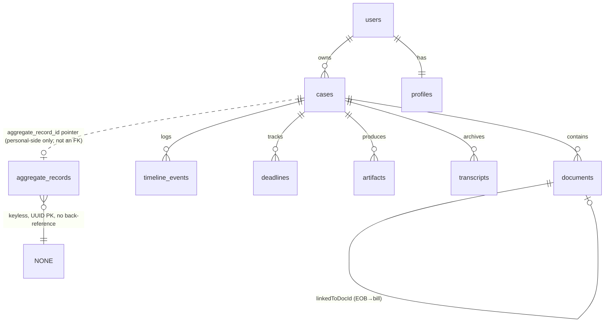

# billcheck v1 — the persistent advocate

## Summary

Turn the validated, stateless prototype into a **persistent advocate**: it remembers the case across visits, drafts the real artifact, tracks deadlines with a durable smart reminder, and ends with a shareable card. The model's reasoning is frozen (already strong + safe — see [docs/observations/SUMMARY.md](../observations/SUMMARY.md)); v1 builds the **deterministic "hands and memory"** around it — Supabase auth + a Postgres case spine with row-level security, model-callable tools, prompt-cached document context, and one Vercel Workflow. Additive: the existing `streamText` route stays the brain and grows a `tools` map.

---

## Problem Frame

The prototype answers well but forgets everything, can't act, and can't track a clock — so a user has no reason to choose it over ChatGPT. The wedge is what a foundation model structurally can't do: remember the case, act in the real world, and be trustworthy enough to hand a bill to (see origin: [docs/brainstorms/2026-06-25-billcheck-v1-requirements.md](../brainstorms/2026-06-25-billcheck-v1-requirements.md)).

---

## Requirements

Traced from origin R1–R16. v1 scope = R1, R3 (account tier), R4–R12, R14, R15 (generic), R16.

- **R1.** Signup-first (anonymous-first + gating is v1.1).
- **R3.** Consent tiers — account-tier at signup; aggregate-tier a separate opt-in (default OFF).
- **R4.** A **Case** is a first-class object: bill(s), EOB(s)/docs, profile, timeline, deadlines.
- **R5.** Document linking — which EOB/doc belongs to which bill; survives out-of-order uploads.
- **R6.** One **active session** per case; prior sessions stored as transcript objects; the active session is seeded with a **case summary + structured state**, not raw transcripts.
- **R7.** Cross-case awareness without losing track of each object/action.
- **R8.** Stored profile/situation applied across sessions — ask once, reuse, proactively apply.
- **R9.** Artifact generation, personalized from the profile.
- **R10.** Deliver: v1 renders download/print/copy; real send is **mocked** but marked "sent" on the timeline.
- **R11.** Artifacts + deadlines saved as tracked objects.
- **R12.** **Smart reminder** — a durable Vercel Workflow that checks case state at the deadline and tailors/suppresses the nudge; email; v1 "new info" = user-side changes.
- **R14.** Anonymized structured data capture, stored separate from the personal case, behind the aggregate consent tier.
- **R15.** **Share card** — generated on demand via an always-available affordance (+ optional advisory conclusion signal).
- **R16.** Treat the system prompt as **frozen**; build capability via tools + memory + structured state.

**Success criteria (v1):** a person uses billcheck instead of ChatGPT because it (1) remembers the case across visits, (2) produces the actual artifact, (3) proactively nudges the deadline, and (4) yields a share card — demoable end-to-end on Vercel.

---

## Scope Boundaries

**In v1:** R1, R3 (account tier), R4–R12, R14, R15 (generic card), R16.

### Deferred for later (v1.1+)
- Anonymous-first onboarding + the anonymous→account migration + feature-gating.
- Real artifact send (fax/mail/email, likely paid).
- Cited-KB / retrieval with trusted source links (R13).
- Rich external reminder signals (EOB posted, provider replied).
- Nicer/selective "legible-win" share card design.

### Outside this product's identity (north-star, not now)
- Insurance-portal connect (Granted = swamp); MyChart/clinical integration.
- Public price-index product; journalist/outrage pipeline; benefits navigator; GFE/upstream prevention.
- Wellthy/employer software integration; pricing / pay-what-you-want.

### Deferred to Follow-Up Work
- A full compliance program (BAA-grade infra, formal de-id certification). v1 bakes the cheap primitives (separate consent, RLS isolation, two-store separation, no health data in logs, deletion path) and flags the rest — consistent with AGENTS.md "no PHI/compliance machinery yet (own/synthetic bills only)."

---

## Context & Research

### Relevant code and patterns (extend, don't rebuild)
- `app/api/chat/route.ts` — the brain: `streamText` + AI Gateway `"anthropic/claude-opus-4.8"` + `await convertToModelMessages(await inlinePrivateBlobs(messages))`. v1 attaches `tools` + `stopWhen: stepCountIs(n)`, inserts auth/case scoping, deterministic persistence, and **prompt-caching** of the doc context.
- `inlinePrivateBlobs()` — fetches private-blob bytes server-side and inlines them as base64 (the model can't fetch URLs). **Keep**, but (a) resolve which blobs to inline **from the DB by owner** (not the client `part.url` — that path is the cross-tenant authorization boundary), (b) surface fetch failures (no silent skip), (c) keep doc ordering stable so the cache holds.
- `app/api/blob-upload/route.ts` — client-upload token route. Currently **unauthenticated** + rejects HEIC silently — both fixed.
- `lib/prompt.ts` — the frozen `SYSTEM_PROMPT` (R16). Becomes a 3-part prompt (below); the advice prose is untouched.
- `app/page.tsx` — single-screen `useChat`; renders `message.parts` by type.

### Institutional learnings
- **Freeze the prompt, build hands not answers** — 33 sims, 0 safety failures; the gap is execution.
- **Model choice is a safety control** — Opus needs AI-Gateway credits in *every* environment; free tier silently down-tiers to Haiku, which is unsafe here. The reminder makes **no model call**.
- **Private-blob fetch→inline + `convertToModelMessages` is async** — keep both; documents now persist (metadata + access control; no `del()` to remove — the prototype already retains).
- **Two render bugs (white-space, remark-gfm)** were invisible to text-only testing — budget a browser pass for every new rendered surface.
- **One hallucination class (a fabricated FDA date)** → artifacts fill from profile and leave external facts as *attributed placeholders*; no cited-KB gate.

### External references (verified June 2026; flag drift)
- **AI SDK v6 (`ai@6.0.209`):** `tool({ inputSchema })`, `stopWhen: stepCountIs(n)` (not `maxSteps`), `hasToolCall`, `Output.object`, **`needsApproval`** (the SDK-native human-in-the-loop gate — a `boolean` or a conditional fn; UI confirms via `addToolApprovalResponse`). Tools surface as `tool-<name>` parts with `state`.
- **Prompt caching (Anthropic via the Vercel AI Gateway):** mark large content with `providerOptions.anthropic.cacheControl: { type: 'ephemeral' }` (or the Gateway's `caching: 'auto'`) on the system prefix + the last inlined-doc part, **after** `convertToModelMessages`. Cache read ≈ 0.1× input (10× cheaper), 5-min TTL (1h optional), min 1,024 tokens, max 4 breakpoints. **Caching reduces cost/latency, NOT context-window usage** — cached docs still count against the 1M-token window, so a size-based trim remains as a capacity fallback for very large cases. Reorder/drop a doc → cache miss, so keep the doc set/order stable per turn.
- **Supabase (June 2026):** Auth via `@supabase/ssr` (browser/server/proxy clients; `proxy.ts` at root — Next 16's `middleware.ts` rename, **Node-runtime only**). Authenticate with **`getClaims()`** (local JWT verify), never `getUser()`/`getSession()` for authz; don't run code between `createServerClient` and the check. New API keys: **publishable** (`sb_publishable_…`, browser+SSR, RLS applies) + **secret** (`sb_secret_…`, backend-only, bypasses RLS). Drizzle via **`postgres-js` over the Supavisor transaction pooler (port 6543, `prepare:false`)** — `db.transaction()` works (no Neon two-driver workaround); migrations via the 5432 connection.
- **RLS:** Drizzle does **not** auto-run as the authed user — it bypasses RLS unless the connection runs as the `authenticated` role with the JWT set. Use the two-client + `.rls(tx => …)` pattern (`drizzle-orm/supabase` `pgPolicy`/`authUid`); RLS depends on `db.transaction()`.
- **Compliance:** not a HIPAA covered entity, but **WA MHMDA applies with no size threshold** (separate opt-in consent, privacy policy, deletion); FTC HBNR applies. EU AI Act Art. 50 (AI-disclosure) + Art. 14 land **2026-08-02** — relevant only for EU users.

---

## Key Technical Decisions

- **Supabase for Postgres + Auth + RLS; keep Vercel Blob for documents.** Pedro already pays for Supabase; it collapses DB + auth + isolation into one service and makes RLS first-class. Vercel Blob stays — the private-upload + server-inline pattern is already built. *(Drops Neon + Clerk vs. the first draft.)*
- **One DB driver: `postgres-js` over the Supavisor transaction pooler** (`prepare:false`). `db.transaction()` works on serverless — so the dependent writes (turn+summary, the scheduleReminder dual-write) are transactional. No two-driver split.
- **RLS-first isolation, in U1 (not deferred).** Every tenant table carries `user_id` + a forced `(select auth.uid()) = user_id` policy; user-facing queries run through the `.rls()` client (JWT-scoped); a `secret`-key admin client is reserved for the Workflow + the aggregate write. A forgotten `WHERE` is then structurally harmless — the DB filters it.
- **Prompt caching, not a relevance heuristic, for document context.** Cache the inlined docs; keep all case docs in context (no fragile selective-inline). Size-based trim is a capacity fallback only (context-window limit, which caching doesn't change).
- **Capability via model-callable tools wired into the existing `streamText`** (R16); one orchestrator, no second framework.
- **Human-in-the-loop via the SDK's `needsApproval`** on the two world-effecting tools (`generateArtifact`, `scheduleReminder`) — conditional: confirm when the trigger is document-borne or a model-*inferred* deadline; skip when the user asked explicitly. This is the injection defense + keeps agent/user parity (one tool, gated), replacing a hand-rolled two-phase commit.
- **Deterministic vs. model-driven seam:** case existence + transcript persist deterministically every turn (never hostage to a tool call). Semantic actions are tools — each server-authoritative (userId from the session, caseId re-validated as owned), idempotent (DB unique-constraint dedup), field-level-merge for blob-shaped state, Zod-validated + `experimental_repairToolCall`.
- **Conclusion is user-driven, not model-detected.** An always-available "wrap up / share" affordance triggers `generateShareCard`; the model emits an advisory per-turn `phase` field that only *surfaces* the CTA when `resolved` (never gates). Case-closed status is set by an explicit `markResolved` action (user or agent), which the reminder reads — not a model auto-flag.
- **`recordAggregate` is deterministic at conclusion (not a model tool), keyless + a personal-side pointer.** The aggregate row carries no key; `cases.aggregate_record_id` (in the RLS-protected case table) lets the conclusion-time write **update in place** (no duplicates) and is destroyed on account deletion.
- **Two privacy-critical guards are server-enforced:** the aggregate write checks consent **before computing** the record; the share card is built from a structured-state **enum/bucketed whitelist**, never the transcript.
- **`drizzle-kit push` for the synthetic-only demo; cut to versioned migrations at the first real signup.**
- **Testing posture:** manual/browser + the existing probe for model behavior, **plus light unit tests for the pure safety/privacy guards** (consent gate, de-identification/PII-strip, reminder branch selection, RLS cross-user invisibility, idempotency).

---

## High-Level Technical Design

> *Directional guidance for review, not implementation specification.*

**Data model (Supabase Postgres; RLS on every tenant table; `aggregate_records` keyless):**


`users.id` = the Supabase `auth.uid()` (UUID). Every tenant table has `user_id` + a forced `auth.uid() = user_id` RLS policy.

**The chat turn (one orchestrator; tools; cached docs; deterministic persistence):**

```mermaid
sequenceDiagram
  participant U as User
  participant R as /api/chat
  participant M as Opus (Gateway, cached prefix)
  participant DB as Supabase (RLS)
  U->>R: message (+files) [Supabase session]
  R->>DB: getClaims() → userId; .rls(): ensure case, persist user turn, load summary+state
  R->>R: inline owner-verified blobs (DB-resolved); cacheControl on system + last doc
  R->>M: streamText(3-part prompt, msgs, tools, stopWhen, needsApproval on world-effecting tools)
  M-->>R: tool calls (save/link/profile/markSent/deadline/share/markResolved/reopen; artifact+reminder gated)
  R->>DB: tools execute under RLS (userId from session, caseId re-validated, idempotent)
  R->>DB: persist assistant turn
  R-->>U: stream text + tool-* parts (plain-language status; details collapsed); approval cards when gated
```

**The smart reminder Workflow (durable, state-aware, cancellable):** unchanged in shape — `sleep` to ~1 day before the deadline, raced against a `case-closed` hook; on wake a step reads **live** state (primary, not replica) and a **pure function** picks the branch (act / gentle-if-sent / past-due / suppress-if-resolved-or-closed / send-failed→timeline); Resend send keyed off `(caseId, deadlineId, branch)` via the `Idempotency-Key` header. Runs under the admin (service-role) client.

---

## Output Structure

    proxy.ts                      # Supabase session refresh (Next 16 rename; Node runtime)
    drizzle.config.ts
    lib/
      supabase/
        server.ts, client.ts, proxy.ts   # @supabase/ssr clients (getClaims-based)
      db/
        index.ts                  # postgres-js / Supavisor pooler; rls(tx) wrapper + admin client
        schema.ts                 # tables + pgPolicy(auth.uid() = user_id)
        cases.ts, documents.ts, profile.ts, deadlines.ts, artifacts.ts, aggregate.ts  # owner-scoped
      auth.ts                     # requireUserId() = getClaims().sub
      tools/                      # one file per tool; makeTools(userId)
      artifacts/generate.ts
      share/card.ts               # whitelist → card (no PII)
      aggregate/deidentify.ts     # Safe-Harbor field hygiene (pure, unit-tested)
      reminder/state.ts           # pure branch selection (unit-tested)
      cache/doc-cache.ts          # cacheControl placement + size-based trim fallback
      email/resend.ts
    lib/workflows/reminder.ts     # 'use workflow' + 'use step'
    app/
      (app)/cases/page.tsx        # case list + empty state
      (app)/cases/[id]/page.tsx   # case detail (timeline, artifacts, wrap-up/share)
      (auth)/                     # Supabase sign-in / sign-up screens
      api/chat/route.ts           # MODIFIED: auth, case spine, tools, cached inline, needsApproval
      api/blob-upload/route.ts    # MODIFIED: auth + HEIC + clearer errors
    test/                         # light unit tests for the pure guards + RLS cross-user check

---

## Implementation Units

> Phased: **Phase 1 (Saturday hackathon slice)** = U1–U7 (thin cuts); **Phase 2 (v1 proper)** = U8–U12 + within-unit completeness. See Phased Delivery.

### U1. Supabase auth + persistence + RLS foundation

**Goal:** Supabase Auth (signup-first) + Postgres + Drizzle wired, the full schema, and RLS-first per-user isolation.

**Requirements:** R1, R4 (substrate), R16 (substrate)

**Dependencies:** None

**Files:** Create `proxy.ts`, `lib/supabase/{server,client,proxy}.ts`, `lib/auth.ts` (`requireUserId()`), `lib/db/index.ts` (pooler client + `rls()` wrapper + admin client), `lib/db/schema.ts`, `drizzle.config.ts`; Modify `app/layout.tsx`, `package.json`, env; Test `test/rls-isolation.test.ts`

**Approach:**
- `@supabase/ssr` three clients; `proxy.ts` refreshes the session (Node runtime; nothing between `createServerClient` and the check). `requireUserId()` = `getClaims().sub` (UUID). Build minimal sign-in/sign-up screens (the cost vs. Clerk's hosted UI).
- Drizzle over `postgres-js` on the **Supavisor transaction pooler** (`prepare:false`); a `.rls(tx => …)` wrapper sets the JWT + `authenticated` role per request (RLS-scoped); a separate **secret-key admin client** for the Workflow + the aggregate write only. Migrations via the 5432 connection.
- Schema for all tables (see ERD); `users.id = auth.uid()`; every tenant table gets `user_id` + a **forced** `(select auth.uid()) = user_id` `pgPolicy`. `aggregate_records`: UUID PK, no FK. `drizzle-kit push` for the synthetic demo; migrations at first real signup.

**Test scenarios:**
- Happy: authed request resolves a stable `userId`; an `.rls()` query returns only that user's rows.
- Edge: unauthenticated request → redirect/401, no DB access; `/api/chat` and `/api/blob-upload` both named in this test.
- Edge (the structural guarantee): a query that *forgets* `where userId` still returns only the session user's rows under RLS.
- Edge: `getDb()`/clients are lazy (no build-time env throw); pooler uses `prepare:false`.
- Integration: user A's rows are invisible to user B through both the query layer and RLS.

**Verification:** signup works; a row created as A is unreadable as B *even with a deliberately unscoped query*; `next build` clean; `db.transaction()` succeeds on the pooler.

### U2. Case spine + deterministic persistence + cached chat-route integration

**Goal:** Cases persist; each turn deterministically saves the transcript and seeds the active session from summary + structured state; the chat route is owner-scoped with prompt-cached, owner-verified document context.

**Requirements:** R4, R6, R16

**Dependencies:** U1

**Files:** Create `lib/db/cases.ts`, `lib/case/summary.ts`, `lib/cache/doc-cache.ts`; Modify `app/api/chat/route.ts`; Test `test/case-seed.test.ts`, `test/doc-cache.test.ts`

**Approach:**
- Route: `requireUserId()` → resolve/create the active case → **deterministically persist the incoming turn** → load **summary + structured state** (not raw transcripts) → inline only **owner-verified** blobs (resolved from `documents` by `(caseId, userId)`, never the client `part.url` — the authorization boundary; surface fetch failures) → apply `cacheControl` to the system prefix + the last doc part → `streamText(..., tools, stopWhen)` → **deterministically persist the assistant turn**.
- **Structured state** (always carried) = profile facts, open question(s), artifacts + status, deadlines, case status. **Summary** = prefer a deterministic structured-state→prose template; if model-generated, budget the extra call, pin to Opus, fall back to the prior summary (never empty). Persist the **blob URL, not the base64**.
- Keep the doc set/order **stable** turn-to-turn so the cache holds; a **size-based trim** drops oldest/least-relevant docs only when the case would exceed a context budget (capacity guard, not a relevance guess).

**Execution note:** write `doc-cache` (which docs to inline + cache-control placement + the size-trim) and the seed builder as pure functions first.

**Test scenarios:**
- Happy: a 3-turn session persists 3+3 turns; resume seeds from summary+state, not transcript; turns 2+ are cache hits (assert `inputTokenDetails.cacheReadTokens > 0`).
- Edge (authz): a message carrying another user's blob URL is **not** inlined (resolved from DB, ownership-checked).
- Edge: prior session ended mid-question → seed reconstructs the open question; prior session crashed (no summary) → fallback seed works.
- Edge: case exceeds the context budget → size-based trim keeps it under, deterministically.
- Error: blob fetch 403/404 → user sees "I can't read that document"; the model doesn't analyze it as read. DB persist failure → "couldn't save," turn not silently lost.

**Verification:** close the tab mid-case and return — resumes coherently; large multi-doc cases stay cheap (cache) and bounded (trim); no cross-tenant doc read.

### U3. Document model + linking

**Goal:** Uploaded docs persist as owner-scoped records; EOB↔bill linking works out of order and is correctable; the upload route is authed + handles HEIC.

**Requirements:** R4, R5

**Dependencies:** U1, U2

**Files:** Create `lib/db/documents.ts`; Modify `app/api/blob-upload/route.ts`, `app/api/chat/route.ts`, `app/page.tsx`; Test `test/document-link.test.ts`

**Approach:** write the `documents` row **before** issuing the upload token (`status='pending'`), confirm via `onUploadCompleted` (currently a no-op) so Postgres is the authoritative blob index for deletion; orphan blobs are detectable. `linkDocument`/`relinkDocument` set `linkedToDocId`, tolerate "no target yet," and are reversible; **retroactive auto-link only when exactly one candidate** (else leave unlinked + surface a choice); guard against self/cycle links. Upload route: session auth + HEIC handled (prefer client-side convert or a clear "upload PDF/JPG/PNG" message — no server-side decoder on untrusted bytes) + errors that name the real limit.

**Test scenarios:** bill→EOB links; EOB-first links retroactively; two bills + one EOB → user-correctable, no wrong auto-link; HEIC → actionable message; 15 MB → names the 10 MB cap; unauthenticated upload-token request → rejected; blob row written before token, confirmed on completion.

**Verification:** documents persist across sessions, render on the case, relink works, and no orphan blob escapes the deletion index.

### U4. AI tools layer (the deterministic capability surface)

**Goal:** Model-callable tools wired into `streamText`, server-authoritative under RLS, idempotent, with `needsApproval` on the world-effecting two — the complete capability layer (agent/user parity).

**Requirements:** R16 (+ substrate for R5/R8/R9/R11/R12/R15)

**Dependencies:** U1, U2

**Files:** Create `lib/tools/index.ts` (`makeTools(userId)`), `lib/tools/*.ts`; Modify `app/api/chat/route.ts`, `lib/prompt.ts`, `app/page.tsx`; Test `test/tools-guard.test.ts`

**Approach:**
- `makeTools(userId)` closes over the session userId; every `execute` runs under the `.rls()` client and re-validates the active case (`resolveActiveCase(userId, requestedCaseId)` → owned only). Zod `inputSchema`; idempotent writes (DB unique-constraint dedup); **field-level merge** for `saveCase`/`updateProfile`; `experimental_repairToolCall`.
- **Tool set = the complete capability surface (every UI action is a tool; buttons call the same tools):** `saveCase`/`updateCase`, `linkDocument`/`relinkDocument` (U3), `updateProfile` (U8), `markArtifactSent`, `updateDeadline`/`cancelDeadline` (U6), `markResolved`/`reopenCase`, `generateShareCard` (U7), and the world-effecting `generateArtifact` (U5) + `scheduleReminder` (U6). **`recordAggregate` is NOT a tool** — deterministic at conclusion (U9). Per phase: Phase 1 wires case/doc/artifact/reminder/share/status tools; `updateProfile` (U8) lands in Phase 2.
- **`needsApproval` on `generateArtifact` + `scheduleReminder`** — a conditional fn: `true` when the trigger is document-borne or a model-*inferred* deadline (injection defense), `false` when the user asked explicitly. The UI renders an edit-before-approve confirmation card; the user approves via `addToolApprovalResponse`. Parity holds (one tool, gated) — no separate commit tool.
- **Prompt = three parts, only the first frozen (R16):** [frozen advice prose] + [static tool catalog: what each tool does] + [dynamic per-turn state block from U2's structured state: open artifacts/deadlines/links/profile/status] — so the agent acts with full context and never re-proposes what exists. Tool/context wiring, not advice-tuning.
- Surface `tool-<name>` parts as **plain-language ✓ status lines, raw details collapsed** (progressive disclosure — never raw JSON to a scared user).

**Test scenarios:**
- Happy: analyze → `saveCase` → `generateArtifact` (approval card) → user approves → artifact created; UI shows ✓ steps.
- Edge: tool fires before a case exists / on an unowned case → safe rejection (RLS + ownership re-check).
- Edge: malformed input ("next month") → structured tool-error, conversation continues.
- Edge: `needsApproval` fires for a document-inferred reminder → user sees the card, can edit/decline.
- Edge: step cap reached mid-plan → committed writes coherent; continuation possible.
- Error: stream dies after `updateProfile`, before `generateArtifact` → profile saved (transaction), no half-artifact, retry no double-write.

**Verification:** the agent acts through tools under RLS; bad/duplicate calls never corrupt or cross users; world-effecting actions from untrusted triggers require approval.

### U5. Artifact generation + delivery

**Goal:** Generate the real artifact, personalized from the profile, render download/print/copy, track it (mock-send → "sent"), gated by `needsApproval` when untrusted.

**Requirements:** R9, R10, R11

**Dependencies:** U4 (U8 profile enhances; degrades without it)

**Files:** Create `lib/artifacts/generate.ts`, `lib/db/artifacts.ts`, `app/(app)/cases/[id]/` artifact view; Modify `lib/tools/generate-artifact.ts`, `app/page.tsx`; Test `test/artifact-placeholders.test.ts`

**Approach:** `generateArtifact` renders a dispute/appeal/complaint/call-script, filling from the profile; unknown personal fields → `[BRACKET]` placeholders; **external facts (dates, citations, codes) stay attributed placeholders** the user/doctor supplies (anti-hallucination). Store `artifacts.contentMd`; download/print/copy. `markArtifactSent` (its own tool) sets `status:'sent'` + a `timeline_event` the reminder reads. The approval card *is* the human review step (the model's call stages it; approval finalizes) — an always-available "draft the letter" button is the same tool.

**Test scenarios:** QMB dispute pulls issue+lever, downloads as a file; empty profile → bracket placeholders, still generates; chat-only case → call-script; never states an unverifiable external specific as fact; mark-sent writes the timeline event the reminder reads.

**Verification:** the user leaves with the actual letter; the case shows it as tracked + mark-sent-able.

### U6. Smart reminder Workflow

**Goal:** A durable Workflow that waits to the deadline, reads live state, tailors/suppresses an email — cancellable when the case closes.

**Requirements:** R11, R12

**Dependencies:** U1, U2, U4, U5

**Files:** Create `lib/workflows/reminder.ts`, `lib/reminder/state.ts` (pure), `lib/email/resend.ts`, `lib/db/deadlines.ts`; Modify `lib/tools/schedule-reminder.ts`, `next.config.ts` (`withWorkflow`), `package.json`; Test `test/reminder-state.test.ts`

**Approach:** `scheduleReminder` (gated by `needsApproval` for inferred deadlines) inserts a `deadline`, dedups on a **`UNIQUE (caseId, deadlineId)`** constraint, then — as a transaction-or-outbox dual-write — writes `reminder_status='pending'`, calls `start(reminderWorkflow,…)`, stores `workflowRunId`, sets `armed`. The workflow: `sleep` to ~1 day before, raced against a `case-closed` hook; on wake a step reads **live state (primary, not replica)** and a **pure function** picks the branch (act / gentle-if-sent / past-due / suppress-if-resolved-or-closed / send-failed→timeline). All IO in steps; body thin (skew protection); Resend keyed off `(caseId, deadlineId, branch)` via the `Idempotency-Key` header. No model call inside. `updateDeadline` reschedules the same logical reminder; `cancelDeadline`/case-close cancels. Pin `workflow@^4.5.0`.

**Execution note:** write `lib/reminder/state.ts` as a pure, unit-tested function first.

**Test scenarios:** deadline in 14 days → act-now email ~1 day prior, timeline logs sent; `scheduleReminder` twice → one workflow, one email (unique constraint); case closed during sleep → hook cancels, no email; not cancelled but resolved → wake-time check still suppresses; deadline already passed at wake → past-due copy; artifact marked sent → gentle copy; Resend fails → retry + `reminder_failed` timeline event; two deadlines → two independent reminders.

**Verification:** demo by fast-forwarding the sleep (`getRun(runId).wakeUp(...)`) **and** a non-fast-forward test (60-s sleep, close mid-sleep, assert suppression) so the branch logic is proven, not just the email.

### U7. Conclusion + share card (user-driven)

**Goal:** A share card the user can produce anytime; case-resolution as an explicit action; no reliance on the model detecting "done."

**Requirements:** R15

**Dependencies:** U2, U4

**Files:** Create `lib/share/card.ts` (whitelist → card), `app/(app)/cases/[id]/` wrap-up/share UI; Modify `lib/tools/{generate-share-card,mark-resolved,reopen-case}.ts`, `app/page.tsx`; Test `test/share-card-pii.test.ts`

**Approach:** an **always-available "wrap up / share" affordance** calls `generateShareCard` (agent-callable AND the button's backstop — same function), building the card from a **structured-state field whitelist of enum/bucketed values only** (issue type, lever, coarse/bucketed outcome) — never the transcript, document text, or a free-text field; one card per case (regenerated, not duplicated); honest copy for non-win outcomes. The model emits an **advisory per-turn `phase` field** (gathering/explaining/resolved) that only *surfaces* the CTA when `resolved` — it never gates and nothing waits on it. `markResolved` (user or agent) sets `caseStatus='resolved'` (what the reminder reads); `reopenCase` is its inverse (re-opens, supersedes the card). No `flagConclusion` tool.

**Test scenarios:** model never signals → the button still produces a valid card; card contains no names/IDs/amounts beyond the whitelist **even when a name was typed into a structured field**; `phase:resolved` surfaces the CTA but doesn't close anything; `markResolved` closes + the reminder suppresses; `reopenCase` re-opens + supersedes the card.

**Verification:** every case can produce a coherent, PII-free card at any time; resolution is an explicit, reversible action.

### U8. Profile / situation (ask once, reuse)

**Goal:** Persist the user's insurance situation and apply it across sessions and artifacts.

**Requirements:** R8

**Dependencies:** U1, U2, U4

**Files:** Create `lib/db/profile.ts`; Modify `lib/tools/update-profile.ts`, `lib/artifacts/generate.ts`; Test `test/profile-apply.test.ts`

**Approach:** `updateProfile` (model-proposed, server-validated, **field-level merge**) upserts `profiles` (insurer, planType incl. fully-insured-vs-self-funded, status: veteran/Medicaid/QMB/income/state). Seeded into structured state (U2) so the model never re-probes; artifacts auto-fill; protected-class facts (QMB→$0) applied proactively.

**Test scenarios:** "QMB" stored in session 1 → applied in session 3 without re-asking; a profile fact fills an artifact blank; two concurrent profile edits merge (no lost update); invalid diff rejected.

**Verification:** the model stops re-asking known facts across sessions.

### U9. Consent + anonymized data capture (deterministic, keyless + pointer)

**Goal:** Separate, default-OFF aggregate consent; a deterministic, de-identified write at conclusion that updates in place.

**Requirements:** R3, R14

**Dependencies:** U1, U7

**Files:** Create `lib/aggregate/deidentify.ts` (pure), `lib/db/aggregate.ts`, consent UI; Modify `markResolved` path, signup flow; Test `test/deidentify.test.ts`, `test/consent-gate.test.ts`

**Approach:** consent state machine — account-tier at signup (required), aggregate-tier a **separate opt-in, default OFF**, versioned. Aggregate capture is a **deterministic step at conclusion (not a model tool)**: on `markResolved`, if the aggregate tier is true, compute the de-identified record (consent checked **before** compute) and write/update via `cases.aggregate_record_id` — **update in place**, no duplicates; the `aggregate_records` row stays keyless (UUID PK, no back-ref, bucketed/jittered insertion time). De-identification (pure, unit-tested): geo = state by default, ZIP3 only if pop>20k, year-only dates, bucketed amounts, enums, no free text, no PII; skip if below a minimum field threshold. Consent copy discloses that contributed records can't be retracted — and the deletion policy honors that (account deletion drops the pointer; the keyless row remains, as disclosed). Runs under the admin client.

**Test scenarios (privacy-critical):** consent false → nothing computed or written; re-conclude → the existing row updates (no duplicate); the row has no `userId`/`caseId` and a UUID PK; sparse bill → no row; a record with any PII-shaped field is rejected (adversarial fuzz: PII salted into every field → stripped/rejected); ZIP in a <20k-pop area → stored as state.

**Verification:** declined users get full features + zero rows; re-concluded cases update one row; stored records pass a Safe-Harbor field check.

### U10. Multi-screen UI + integration test pass

**Goal:** The persistent app's screens, empty/error states, progressive-disclosure tool UX, and a browser pass for the new rendered surfaces.

**Requirements:** R4, R6, R9, R10, R15 (surfacing)

**Dependencies:** U2–U9

**Files:** Create `app/(app)/cases/page.tsx`, `app/(app)/cases/[id]/page.tsx`, `app/(auth)/`; Modify `app/page.tsx`, `app/globals.css`

**Approach:** case list + a **no-cases home that feels like relief** (auto-create the first case on first message); case detail (timeline, artifacts, wrap-up/share); render `tool-*` parts as **plain-language ✓ steps with collapsed details** (never raw JSON); approval cards (edit-before-approve) for the gated tools; artifact download + share-card UI; consent UI; **upload-failure fallback ("just tell me about it")**; re-auth-without-loss; a single-active-session ("opened elsewhere") notice. Reuse the white-space + remark-gfm fixes on every new markdown surface; run a browser/integration pass.

**Test scenarios:** signup → land → first message creates one case; upload failure offers retry + describe-instead; artifact downloads; share card renders; approval card renders + edit-before-approve works; tables/markdown render on the new surfaces; two tabs on one case → defined non-corrupting behavior.

**Verification:** the end-to-end flow is demoable in a browser; no render regressions; tool activity is legible without raw JSON.

### U11. Multi-case / cross-case awareness

**Goal:** Multiple cases per user with correct binding and light cross-case context — no conflation.

**Requirements:** R7

**Dependencies:** U2, U4, U6

**Files:** Modify `lib/db/cases.ts`, `app/api/chat/route.ts`, `lib/case/summary.ts`

**Approach:** explicit "new case" vs. "belongs to active case" decision (not a new case per mentioned bill); inject **light** cross-case context (other open cases by title/provider, not contents); tools always bind the active `caseId` (RLS + ownership re-check); cross-case reminders independent. A durable case-relationship object is out of v1 scope (stated).

**Test scenarios:** a second unrelated bill in an active session → correctly starts case B (or joins A) per the rule; a tool writes only the active case; closing case A doesn't suppress case B's reminder.

**Verification:** a multi-case user's objects never bleed across cases.

### U12. Hardening + compliance primitives

**Goal:** The remaining defense-in-depth + the cheap compliance primitives. (RLS itself now lands in U1.)

**Requirements:** R3 (data handling), R16 (substrate)

**Dependencies:** U1 (final)

**Files:** Create `app/privacy/page.tsx`, deletion path; Modify logging/telemetry config

**Approach:** keep bill contents/amounts/CPT out of logs and any third-party analytics/error tracker (decide the redaction posture in U2/U4 where the handlers are written — don't echo raw errors); keep them out of the **Workflow payload** (pass only `caseId`/`deadlineId`). Account+data deletion (drops the personal rows + the `aggregate_record_id` pointer; the keyless aggregate row remains as disclosed). Define `ON DELETE` cascade for every child + **cancel live reminder workflows** on case/account deletion. Consumer-health **privacy policy + separate-consent copy must exist before the app is publicly reachable** (MHMDA, no size threshold). Confirm the AI Gateway request-logging is off / retention-bounded for medical content, and Opus credits cover every environment.

**Test scenarios:** a deliberately unscoped query still returns only the session user's rows (RLS, from U1); deletion removes personal rows + pointer + cancels reminders (keyless aggregate rows remain); no health data in logs; AI-Gateway logging confirmed off.

**Verification:** isolation holds at the DB layer; deletion is complete + honest; a security review of the isolation + redaction path passes.

---

## Hardening notes (carried from the security / data-integrity / agent-native reviews)

Most findings are now folded into the units above; these are the cross-cutting principles to preserve:

- **Document inlining is an authorization boundary** (U2): resolve from the DB by owner, never the client `part.url`; reject unresolved. RLS (U1) is the backstop.
- **Agent/user parity** (U4): every UI action is a tool; UI buttons call the same tools; `needsApproval` gates the two world-effecting tools without removing the capability.
- **Keyless aggregate store** (U9): UUID PK, no back-reference, bucketed+jittered time, consent-checked-before-compute, updated in place via the personal-side pointer; account deletion honors the "can't retract" disclosure.
- **Write consistency** (U2/U6): `db.transaction()` (Supabase pooler) for dependent writes; the scheduleReminder dual-write uses a `reminder_status` state column.
- **Redaction where the leak is introduced** (U2/U4/U6), **`push`→migrations at first signup** (U1/U12), **prompt-caching keeps docs cheap but watch the context window** (U2).

---

## System-Wide Impact

- **Interaction graph:** the chat route triggers tool executions (RLS-scoped DB writes), gated approvals for world-effecting tools, and starts Workflows; `markResolved` sets status the reminder reads.
- **Error propagation:** tool errors return structured results (conversation continues); persist failures + blob-fetch failures surface to the user (no silent analysis).
- **State lifecycle risks:** partial multi-step turns (transactions), duplicate tool calls (unique constraints), reminder double-arm (constraint + state column), re-opened cases — all addressed.
- **API surface parity:** both routes gain auth; new routes inherit `requireUserId()` + run under RLS.
- **Unchanged invariants:** the frozen advice prose, the AI Gateway model string, the private-blob inline mechanism, and the v6 message-parts contract are preserved.

---

## Risks & Dependencies

| Risk | Likelihood | Impact | Mitigation |
|---|---|---|---|
| Tools hostage to model calls (omit/duplicate) | High | High | Deterministic case/transcript persistence; idempotent RLS-scoped tools; always-available buttons for artifact + share |
| Cross-tenant read (blob inline / forgotten WHERE) | Low (with RLS) | High | RLS-first (U1, `auth.uid()`, forced) + DB-resolved owner-checked inlining (U2) |
| Document-borne prompt injection drives action tools | Med | Med | Server-authoritative scoping (no cross-tenant impact) + `needsApproval` on the two world-effecting tools |
| Context-window overflow on a large case (caching ≠ window) | Med | Med | Size-based trim fallback (U2); Opus 4.8 1M window covers typical cases |
| Cache miss from doc reorder/drop | Med | Low | Keep the doc set + order stable per turn (U2) |
| Drizzle bypasses RLS if run as service-role by mistake | Med | High | `.rls()` client for all user-facing queries; admin client only for Workflow + aggregate (U1/U4) |
| `drizzle-kit push` drops columns on real data | Med | High | Cut to versioned migrations at first real signup |
| Opus silently down-tiers to Haiku if gateway unfunded | Med | High (safety) | Confirm credits in every env; reminder makes no model call |
| 7-hour hackathon overrun | High | Med | Phased Delivery + cut-line (below): security non-negotiables ship before demo polish |

**External dependencies:** Supabase (Postgres + Auth, already paid), Vercel Blob, Resend, Vercel Workflows, AI Gateway credits. New env: `NEXT_PUBLIC_SUPABASE_URL`, `NEXT_PUBLIC_SUPABASE_PUBLISHABLE_KEY`, `SUPABASE_SECRET_KEY`, `DATABASE_URL` (Supavisor 6543), `RESEND_API_KEY` (+ existing `AI_GATEWAY_API_KEY`, `BLOB_READ_WRITE_TOKEN`). Dropped: Neon, Clerk.

---

## Phased Delivery

### Phase 1 — Saturday hackathon slice (~7h, demoable core)
Thin cuts of **U1** (Supabase auth + Postgres + RLS — fewer moving parts than Neon+Clerk: ~30–45 min of auth UI, RLS is a few policy lines, transactions just work), **U2** (case spine + deterministic persist + cached owner-verified inlining), **U3** (doc record + link), **U4** (tools + `needsApproval`), **U5** (artifact + download), **U6** (the reminder Workflow — the headline), **U7** (always-available share card + `markResolved`), minimal **U10**. Demo: signup → upload → analyze → draft artifact (approval card → download) → save case + deadline → smart reminder → share card.

**Phase-1 security non-negotiables:** RLS policies live (the cross-user-invisibility test is the gate); DB-resolved owner-checked inlining; `resolveActiveCase` ownership re-check in tools; `needsApproval` on the world-effecting tools. **Cut-line under clock pressure:** descope *demo polish* (reminder copy, share styling, faked send) before any security non-negotiable. Phase-1 accounts are synthetic/own-bills only (per AGENTS.md); the privacy policy + consent UI gate *public* reachability (Phase 2).

### Phase 2 — v1 proper
**U8** (profile reuse), **U9** (consent + deterministic aggregate capture), **U11** (multi-case), **U12** (deletion + logs + privacy policy), plus within-unit completeness: full reminder branch copy + email-fail + reschedule (U6), document-linking lifecycle (U3), real Resend send, re-auth/two-tab handling, the full browser pass (U10).

---

## Alternative Approaches Considered

- **Neon + Clerk (the first draft):** rejected — Pedro already pays for Supabase, which collapses DB+auth+RLS into one service, makes isolation first-class, and removes the `neon-http` two-driver transaction workaround. (Vercel Blob is kept; Supabase Storage would only win if serving files directly to browsers.)
- **Custom two-phase propose/commit tools:** rejected in favor of the SDK-native `needsApproval` — same injection defense + parity, far less plumbing, no separate commit tools.
- **Selective document-inlining heuristic:** rejected in favor of prompt caching — keeps all docs in context cheaply with no relevance-recall risk; a size-based trim remains only as a capacity guard.
- **Model-detected conclusion (`flagConclusion`):** rejected as a trigger — production consumer chat apps don't auto-detect "done"; an always-available user affordance + an advisory per-turn `phase` signal is simpler and avoids a false "you're finished."
- **Vector/graph memory (mem0/Zep-style):** rejected as over-engineering for a single-case-per-user app — structured-state-in-Postgres + a compact summary is the pragmatic 2026 default.

---

## Documentation Plan

- Update `README.md` + `AGENTS.md` in the same change (Supabase stack, RLS, prompt caching, the env vars; the deterministic-vs-tool seam).
- Mark the requirements doc's open questions resolved (datastore=Supabase, auth=Supabase, caching, conclusion=user-driven, aggregate=deterministic+pointer).
- After landing, capture the load-bearing decisions via `/ce-compound` (no `docs/solutions/` exists yet).

---

## Open Questions

### Resolved during planning
- **Datastore + auth:** Supabase Postgres + Auth + RLS (already paid); Vercel Blob kept for documents; Resend for email.
- **DB driver / transactions:** `postgres-js` over the Supavisor transaction pooler (`prepare:false`) — one client, `db.transaction()` works.
- **Document context:** prompt caching (keep all docs in context) + a size-based trim fallback — not a relevance heuristic.
- **Conclusion/share:** user-driven (always-available affordance → `generateShareCard`) + an advisory per-turn `phase` field; `markResolved`/`reopenCase` are explicit status actions; no `flagConclusion` trigger.
- **Human-in-the-loop:** the SDK's `needsApproval` (conditional) on the two world-effecting tools.
- **Aggregate:** deterministic at conclusion, keyless row + `cases.aggregate_record_id` pointer for update-in-place; account deletion honors the "can't retract" disclosure.

### Deferred to implementation
- Exact structured-state field list + whether the summary is a deterministic template or a model call (decide against real sessions).
- The size-trim policy's exact budget + which docs it drops first.
- ZIP3 population-threshold data source (bake a table vs. default-to-state).

---

## Sources & References

- **Origin:** [docs/brainstorms/2026-06-25-billcheck-v1-requirements.md](../brainstorms/2026-06-25-billcheck-v1-requirements.md)
- **Testing evidence:** [docs/observations/SUMMARY.md](../observations/SUMMARY.md), [docs/observations/ui/SUMMARY.md](../observations/ui/SUMMARY.md)
- **Code:** `app/api/chat/route.ts`, `app/api/blob-upload/route.ts`, `lib/prompt.ts`, `app/page.tsx`
- **External (June 2026):** AI SDK v6 (tools / `stopWhen` / `needsApproval` / `Output`); Anthropic prompt caching via the Vercel AI Gateway (`cacheControl`, context-window counting, pricing); Supabase `@supabase/ssr` on Next 16 (`getClaims`, `proxy.ts`), Supabase + Drizzle (`postgres-js` / Supavisor pooler), Supabase RLS + `auth.uid()` + the Drizzle `.rls()` pattern; Resend; WA MHMDA + FTC HBNR; EU AI Act Art. 50/14 (2026-08-02).
